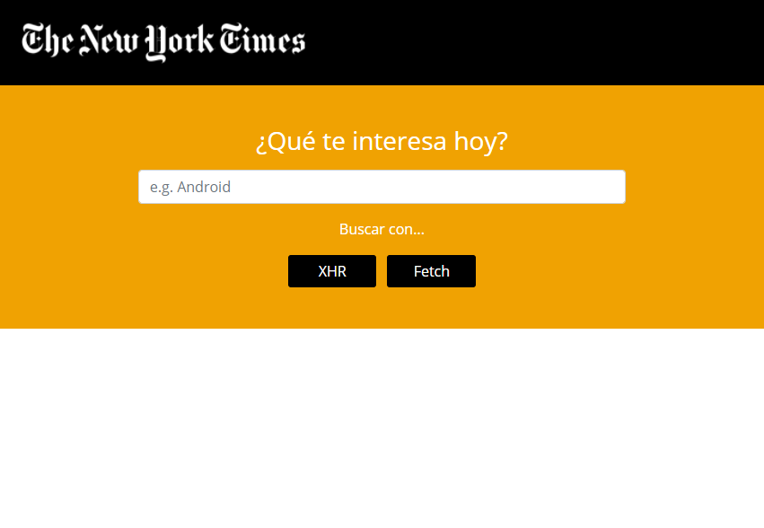
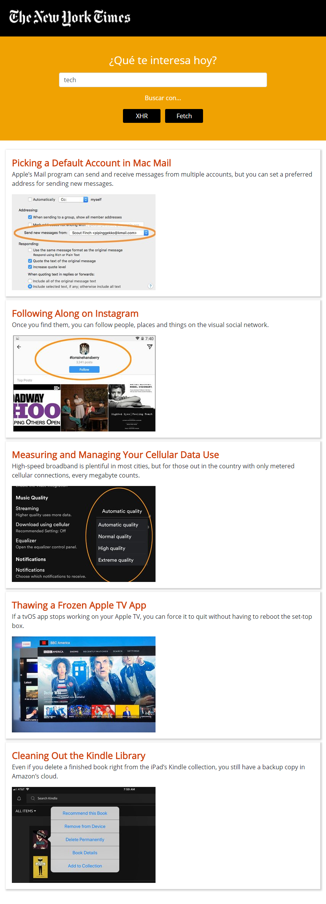

# Demo XHR

Web app que utiliza **ajax** y la API del New York Times para realizar la búsqueda de artículos.

La aplicación funciona con los métodos **XMLHttpRequest** y la API **fetch** de HTML5.

Se pide al usuario que ingrese una palabra para realizar la búsqueda y se ofrecen las opciones de qué método utilizar mediante dos botones.

Una vez que el usuario haya elegido el método para realizar la petición, se mostrarán los 5 primeros resultados de la búsqueda.

